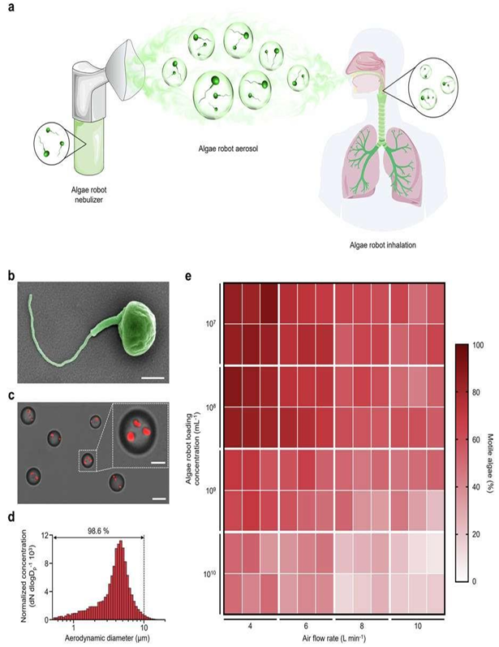


# 폐에 효과적으로 약을 전달하는 ‘생체 모방 미세로봇’ 이야기

## 소개

폐에 생기는 심각한 곰팡이 감염, 예를 들어 침습성 아스페르길루스증 같은 병은 치료가 쉽지 않습니다. 특히 곰팡이약이 폐 속 깊숙이 잘 도달하지 못하고, 몸 전체에 약물이 퍼져 부작용이 생길 위험도 큽니다.

기존 약들은 몸에 주사하거나 흡입하는 형태로 쓰이지만, 폐 안의 끈적한 점액층과 폐 청소 시스템 때문에 깊은 곳까지 약이 잘 도달하지 못했습니다.

이 문제를 해결하기 위해 최근 연구된 **생체 모방 미세로봇**은 자연에서 움직이는 미생물(조류나 박테리아 등)을 본떠 만든 아주 작은 로봇입니다. 이 미세로봇은 스스로 움직이며 폐 점액을 뚫고 약물을 정확한 곳에 전달합니다.

## 폐 속 약물 전달이 어려운 이유

-   폐의 기관지부터 작은 기도는 끈적한 점액으로 덮여 있어 이물질을 잡아내고, 섬모라는 작은 털들이 점액을 밖으로 밀어내 폐를 청소합니다.
    
-   우리가 흡입하는 약물입자들은 이 점액에 걸려버려 폐 깊숙이 도달하지 못하고 빠르게 배출됩니다.
    
-   곰팡이가 만든 진균 덩어리(바이오필름)도 점액처럼 약물 이동을 막습니다.
    
-   약을 더 많이 써도 부작용 위험만 커질 뿐, 실제 효과는 제한적입니다.
    

## ‘생체 모방 미세로봇’의 어떻게 문제를 해결하나요?

-   이 미세로봇들은  **스스로 움직이는 힘**이 있어 점액 속을 헤엄치며 깊은 폐 조직까지 약을 전달합니다.
    
-   자연계 미생물의 움직임 방법(꼬리 같은 기관을 움직여 나아가는 것)을 차용했습니다.
    
-   약을 담은 나노입자(아주 작은 알갱이)를 미세로봇에 붙여 약물을 운반합니다.
    
-   면역세포가 제거하지 못하게 미세로봇 표면에 코팅을 해 ‘눈에 안 띄게’ 만듭니다.
    
-   **운동력 + 점액 분해 효소**  등을 이용해 점액을 뚫고 이동합니다.
    

## 구체적인 미세로봇 종류와 원리

미세로봇 종류

특징과 원리

폐 약물 전달 장점

**조류 기반 바이오하이브리드 미세로봇**

초록색 조류 세포가 자기 꼬리(편모)를 이용해 움직임, 약물 담은 나노입자를 붙임

자연 분해 가능, 폐 깊숙이 침투, 면역 반응 회피, 5일 이상 폐에 남아 약 효과 지속

**효소 촉매로 움직이는 나노봇**

카탈라아제 효소가 폐 점액 속 과산화수소를 분해해 산소 버블 생성, 이 힘으로 움직임

점액 빠르게 뚫음, 일반 입자보다 60배 이상 점액 투과능력 높음

**자기장 유도 미세로봇**

외부 자기장을 이용해 방향과 위치 조절, 자기장 회전으로 코르크처럼 헤엄침

폐 내 특정 부위로 약을 정밀 전달 가능, 비침습적 방향 제어

## 실험 결과와 기대 효과

-   마우스 폐에서  **조류 미세로봇은 5일 이상 체류하며, 곰팡이·세균 감염을 1000배 넘게 줄임**을 확인했습니다.
    
-   효소 나노봇은 점액을 빠르게 뚫고 28% 정도 점액층을 통과한 반면, 일반 나노입자는 0.5%만 통과해 효율이 대폭 향상됨을 보여줌.
    
-   이 기술로 약물이 폐 내부 구석구석까지 균일하게 퍼질 수 있어, 오랜 시간 동안 고농도의 약물이 곰팡이 감염 부위를 공격합니다.
    
-   기존 정맥 주사 대비 전신 부작용은 줄이고, 현저히 높은 치료 효과를 기대할 수 있습니다.
    

## 실생활에서 어떻게 쓰일까?

-   중증 면역력 저하 환자의 폐 곰팡이 감염 치료에 보조제 또는 1차 치료제로 활용 가능.
    
-   폐 이식 환자나 중환자실 환자에게는 폐에 직접 약물을 안착시키는 비침습적 치료로 사용.
    
-   큰 곰팡이 덩어리(아스페릴로마) 치료 시, 침습적 수술 없이 미세로봇이 환부까지 찾아가 약물 전달 가능.
    
-   술이나 천식 등 폐 점액 분비가 많아 약물 전달이 어려운 만성 폐질환에도 적용 가능성.
    

## 앞으로의 과제와 전망

-   미세로봇 대량 생산과 품질 관리, 안정적인 저장법 개발이 필요합니다.
    
-   환자에게 안전한지, 반복 사용 시 부작용이 없는지 철저한 검증이 요구됩니다.
    
-   미세로봇 위치 추적 및 제어 기술(자기장, 영상 등) 개발이 병행되어야 합니다.
    
-   자가 조립, 환경 반응형 약물 방출, 여러 약물 복합 전달 등 스마트 기능 추가 연구 진행 중입니다.
    
-   점액을 뚫는 ‘작은 로봇들이 폐 안에서 약을 정확히 전달’하는 미래의 치료법으로 기대받고 있습니다.
    

## 출처

이 글은 아래 논문 내용을 바탕으로 작성되었습니다.  
Rahane et al. (2025).  _Bio-Inspired Mucus-Penetrating Micro Motors For Enhanced Pulmonary Delivery Of Antifungal Agents_. International Journal of Environmental Sciences, 11(16S), 1047-1061.  
DOI 및 상세 내용 관련 문의는 원문 참고 바랍니다.
